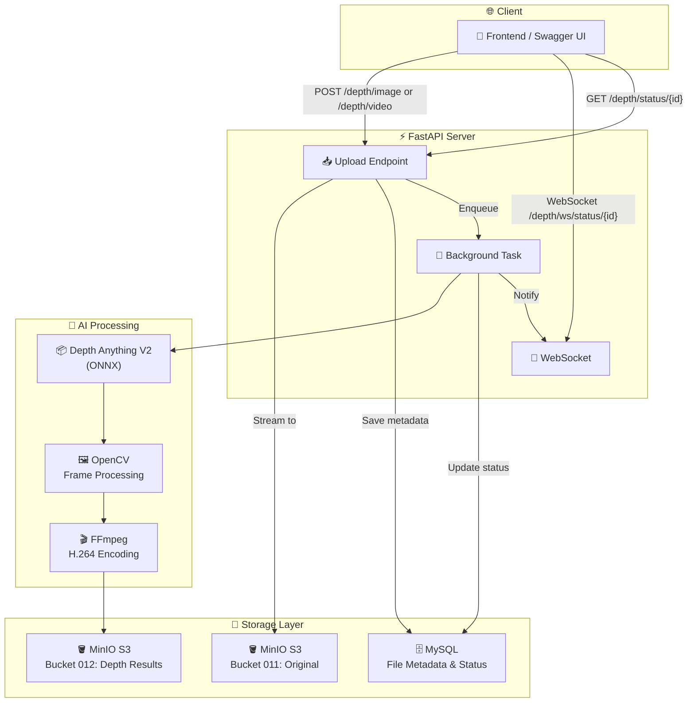
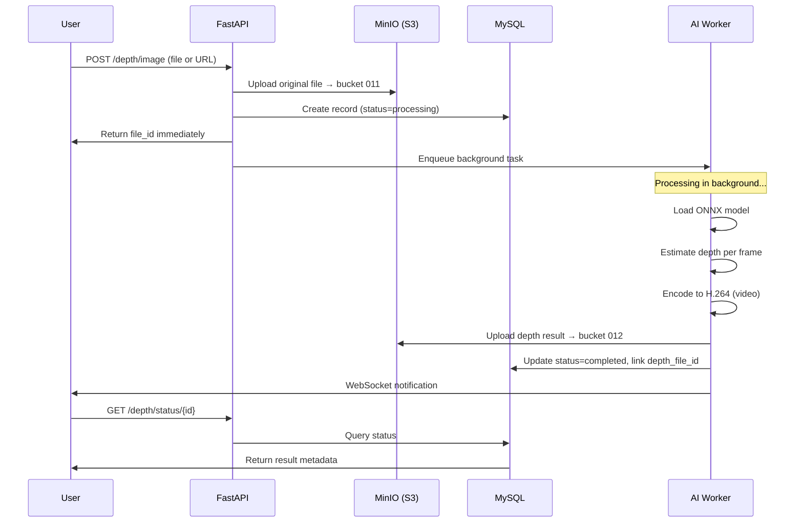
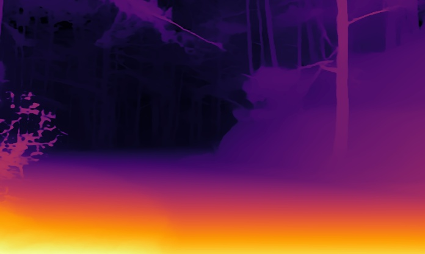
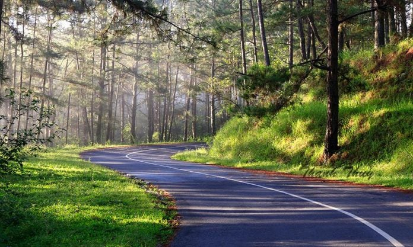
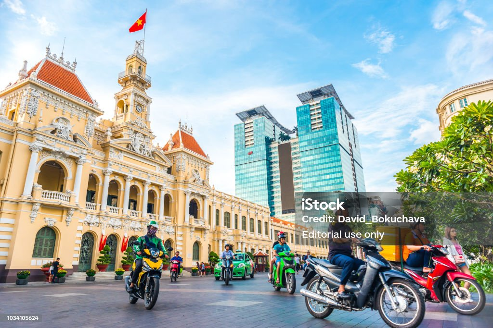

# 🎯 DepthForge — Depth Estimation API

> Transform ordinary images and videos into stunning 3D depth maps with AI-powered depth estimation.

<p align="center">
  
  
  
  
  
</p>

---

## ✨ Features

- **Image Depth Estimation** — Upload an image and get a beautiful depth map
- **Video Depth Estimation** — Process entire videos frame-by-frame
- **Multi-Source Input** — Upload directly, paste a URL, or import from YouTube
- **Real-Time Progress** — Track processing status via WebSocket or polling
- **ONNX Optimized** — Fast inference using Depth Anything V2 in ONNX format
- **Web-Ready Output** — Videos auto-encoded to H.264 for browser playback
- **Object Storage** — Files managed via MinIO/S3-compatible storage

---

## 🗺️ Architecture



### Data Flow



---

## 📂 Project Structure

```
file_upload_system/
├── main.py                      # FastAPI entry point
├── requirements.txt             # Python dependencies
├── Dockerfile                   # Container build
├── docker-compose.yml           # Full stack orchestration
├── .env.docker                 # Environment template
├── mysql-init.sql               # Database schema
│
├── configs/
│   ├── setting.py              # Environment variables
│   ├── database.py             # SQLAlchemy setup
│   ├── minio_store.py          # S3 client config
│   └── celery_app.py           # Task queue config
│
├── models/
│   └── file.py                # FileModel ORM
│
├── routers/
│   ├── file_router.py          # /files/upload
│   └── depth_router.py        # /depth/*
│
├── services/
│   ├── file_service.py         # Upload, download, MinIO
│   ├── depth_service.py        # ONNX inference
│   ├── tasks_service.py        # Background processing
│   └── websocket_service.py    # Real-time notifications
│
├── schemas/
│   └── file.py                # Pydantic schemas
│
└── checkpoints/                # ONNX model files
    └── depth_anything_v2_vits.onnx
```

---

## 🐳 Quick Start with Docker

### Prerequisites

- [Docker](https://docs.docker.com/get-docker/) installed
- [Docker Compose](https://docs.docker.com/compose/install/) installed

### 1. Clone & Setup

```bash
git clone <your-repo-url>
cd file_upload_system
cp .env.docker .env        # Copy environment template
```

### 2. Download the Model

Download **Depth Anything V2** (ViT-S) from HuggingFace:

```bash
# Create checkpoints directory
mkdir -p checkpoints

# Download the ONNX model
# Option A: Using huggingface-cli
huggingface-cli download --local-dir checkpoints \
    depth-anything/Depth-Anything-V2/checkpoints/depth_anything_v2_vits.onnx

# Option B: Direct wget
wget -O checkpoints/depth_anything_v2_vits.onnx \
    "https://huggingface.co/depth-anything/Depth-Anything-V2/resolve/main/checkpoints/depth_anything_v2_vits.onnx"
```

### 3. Launch

```bash
docker compose up --build
```

All services start automatically:

| Service | URL | Description |
|---------|-----|-------------|
| **FastAPI** | http://localhost:8001 | API server |
| **Swagger UI** | http://localhost:8001/docs | Interactive API docs |
| **MinIO API** | http://localhost:9002 | S3-compatible API |
| **MinIO Console** | http://localhost:9003 | Web dashboard |
| **MySQL** | localhost:3307 | Database (internal) |

### 4. Create MinIO Buckets (auto)

The `minio-init` service creates buckets automatically on first run:
- `011` — Original uploaded files
- `012` — Depth estimation results

---

## 🧪 API Endpoints

### Depth Estimation

| Method | Endpoint | Description |
|--------|----------|-------------|
| `POST` | `/depth/image` | Estimate depth from image (file or URL) |
| `POST` | `/depth/video` | Estimate depth from video (file, URL, or YouTube) |
| `GET` | `/depth/status/{file_id}` | Poll for processing status |
| `WS` | `/depth/ws/status/{file_id}` | Real-time WebSocket updates |

### File Management

| Method | Endpoint | Description |
|--------|----------|-------------|
| `POST` | `/files/upload` | Upload a single file |
| `POST` | `/files/upload-multiple` | Upload multiple files |

### Examples

**Upload an image (cURL):**
```bash
curl -X POST "http://localhost:8001/depth/image" \
  -F "file=@/path/to/your/image.jpg"
```

**Upload from URL (cURL):**
```bash
curl -X POST "http://localhost:8001/depth/image" \
  -F "url=https://example.com/photo.jpg"
```

**Upload a YouTube video (cURL):**
```bash
curl -X POST "http://localhost:8001/depth/video" \
  -F "url=https://www.youtube.com/watch?v=dQw4w9WgXcQ"
```

**Check status:**
```bash
curl "http://localhost:8001/depth/status/1"
```

---

## 🎨 Results

### Image Depth Estimation

**Example 1: Forest Road**

| Original Input | Depth Map Output |
|:---:|:---:|
|  |  |

The model correctly identifies the foreground grass and road, while preserving depth gradients into the forest. Closer surfaces (warm tones: yellow/orange) versus distant trees (cool tones: purple/black).

---

**Example 2: Urban Street Scene**

| Original Input | Depth Map Output |
|:---:|:---:|
|  |  |

Complex scene with multiple depth layers: foreground motorcycles and people are sharply delineated, mid-ground building architecture is preserved, and the sky fades into the deepest layer. The model successfully separates individual objects even in crowded scenes.

### Video Processing

Videos are processed frame-by-frame, with each frame passed through the ONNX model. The output is re-encoded to H.264 for seamless browser playback.

```
Frame 1  ████████████░░░░░░░░░  42%
Frame 2  ██████████████░░░░░░░░  58%
Frame 3  █████████████████░░░░  73%
...
Complete  ██████████████████████  100%
```

### Depth Map Color Interpretation

The depth maps use the **INFERNO** colormap:

```
🟢 CLOSER objects    (warm colors: red, orange, yellow)
🔵 FARTHER objects   (cool colors: purple, black)
```

---

## 🔬 Technology Stack

| Category | Technology | Purpose |
|----------|------------|---------|
| **Web Framework** | FastAPI | High-performance async API |
| **Server** | Uvicorn | ASGI server |
| **Database** | MySQL 8.0 | Metadata & status tracking |
| **ORM** | SQLAlchemy 2.0 | Database abstraction |
| **Object Storage** | MinIO | S3-compatible file storage |
| **AI Model** | Depth Anything V2 | State-of-the-art depth estimation |
| **AI Runtime** | ONNX Runtime | Fast cross-platform inference |
| **Image Processing** | OpenCV | Frame extraction & manipulation |
| **Video Encoding** | FFmpeg | H.264 video encoding |
| **Video Download** | yt-dlp | YouTube & URL video downloading |
| **Real-time** | WebSocket | Live progress notifications |
| **HTTP Client** | httpx | Async URL content fetching |
| **Validation** | Pydantic | Request/response schemas |

---

## 💻 Local Development (Without Docker)

### Prerequisites

- Python 3.11+
- MySQL server running
- MinIO server running
- FFmpeg installed

### Setup

```bash
# Create virtual environment
python -m venv .venv
source .venv/bin/activate      # Linux/macOS
.venv\Scripts\activate         # Windows

# Install dependencies
pip install -r requirements.txt

# Configure environment
cp .env.docker .env
# Edit .env with your local credentials

# Download ONNX model
mkdir -p checkpoints
# ... download model as shown above ...

# Run server
uvicorn main:app --reload
```

---

## 🔒 Security Notes

- Credentials are stored in `.env` (already in `.gitignore`)
- MinIO buckets have public download access for serving files
- For production, use Docker Secrets or a vault service
- Never commit real credentials to version control

---

## 📄 License

MIT License — built for learning and research purposes.
